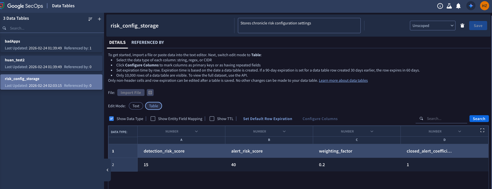

# Chronicle Risk Config Sync Guide

This script automates the process of fetching Risk Configuration settings from Chronicle and storing them in a Data Table.

## Prerequisites

1. **Google Cloud SDK (gcloud)**: Must be installed and available in the system PATH.
2. **Python 3**: The script uses standard libraries and `curl` for API calls.

## IAM Permissions

The identity running the script (User or Service Account) must have the following IAM roles in the Google Cloud project where Chronicle is located:

- **Chronicle API Viewer (`roles/chronicle.viewer`)**: Required to read the Risk Configuration.
- **Chronicle API Editor (`roles/chronicle.editor`)**: Required to create and manage Data Tables and rows.

Additionally, ensure the identity has access to the following API scope:
- `https://www.googleapis.com/auth/chronicle-sdk`

## How to Run

### Option 1: Using User Authentication
```bash
python3 sync_risk_to_table.py --project [PROJECT_NUMBER] --location [LOCATION] --instance [INSTANCE_ID]
```

### Option 2: Using a Service Account
```bash
python3 sync_risk_to_table.py --key-file path/to/key.json --project [PROJECT_NUMBER] --location [LOCATION] --instance [INSTANCE_ID]
```

## What the Script Does

1. **(Optional) Authenticates**: If `--key-file` is provided, it runs `gcloud auth activate-service-account`.
2. **Fetches** the current Risk Configuration from the Chronicle API.
3. **Checks** if a Data Table named `risk_config_storage` exists.
   - If it doesn't exist, it creates it with numeric columns.
4. **Inserts** a new row with the current configuration values:
   - `detection_risk_score`
   - `alert_risk_score`
   - `weighting_factor`
   - `closed_alert_coefficient`

## Verification

You can verify the data in the Chronicle UI:
[Risk Config Storage Table](https://<YOUR_CHRONICLE_DOMAIN>/settings/data-tables)

### Sample Output

